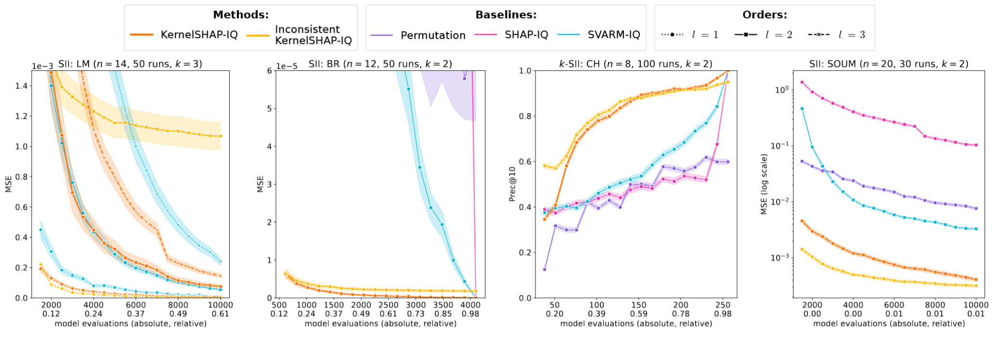
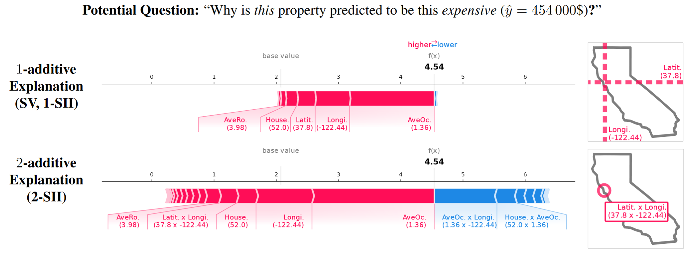

# 📄 Supplement Material: KernelSHAP-IQ: Weighted Least Square Optimization for Shapley Interactions

This repository contains the technical supplement of the contribution titled _KernelSHAP-IQ: Weighted Least Square Optimization for Shapley Interactions_.

## 🛠 Install
Install via pip is not supported.
Please clone the repository and install the requirements via `pip install -r requirements.txt`.

Further, to run the experiments, you need to download the data and imagenet images and place them in the correct folders.
Retrieve the `data` and `imagenet_images` folders from [here](https://www.dropbox.com/scl/fo/g56xj57ovtc7chitz4w1l/h?rlkey=u6uy9yy7flfxr0ikfibjegrku&dl=0).
Unzip the `data` folder and place it in under `games/` (result: `games/data/`).
Unzip the `imagenet_images` folder and place it under `games/` (result: `games/imagenet_images/`).

## 🚀 Reproduce the Approximation Quality Experiments for 
You can reproduce and visualize the experiments by running the following scripts:
You can download the exact files we created during the experiments from [here](https://www.dropbox.com/scl/fo/g56xj57ovtc7chitz4w1l/h?rlkey=u6uy9yy7flfxr0ikfibjegrku&dl=0).
Extract the `results` folder and place it under the root folder of this repository (result: `results/`).
Extract the `results_plot` folder and place it under the root folder of this repository (result: `results_plot/`).

### Run the experiments
To reproduce the experiments, please run the following files:
- `python exp_approx_lookup.py` to run the experiments on the pre-computed game evaluations.
- `python exp_approx_soum.py` to run the experiments on the SOUMs.

### Visualize the results
The results will be stored in a `results` folder (will be created if not present).
To visualize the results you have to move the results from the results folder to a `results_plot` folder.
For this please run the following script which copies the results to the correct folder structure:
- `python utils_move_soum_results.py`

Now you can run the following scripts to visualize the results:
- `python plot_approx.py` to show the approximation quality of the different methods. 

Please note that the plotting script is quite finicky and you might have to manually adjust the parameters in the script to load the correct results and plot the right things.
You can adjust what results to load by changing the parameters by changing the parameters in the `plot_approx.py` file lines 113-149.
You can adjust what to plot in changing the parameters in lines 174-202.

This should give you plots like the following:

## 🚀 Reproduce the Illustration and Use Case Experiments
You can reproduce and visualize the experiments by running the following scripts:
- `python use_case_nlp_network_plots.py` to create the network plots for the NLP use case. See Figure 1 in the paper.
- `python use_case_california_force_plot.py` to create the force plot for the California housing dataset. See Figure 2 in the paper.

